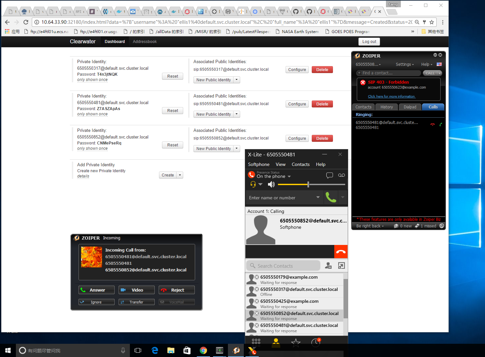

# Content

## Build

    [tangfx@localhost alt-ops]$ make

## Deploy

Etcd

	[tangfx@localhost k8s-manifests]$ ~/bin/kubectl create -f etcd-service.yaml
	service "etcd" created

	[tangfx@localhost k8s-manifests]$ ~/bin/kubectl create -f etcd-deployment.yaml
	deployment "etcd" created

Memcache, Chronos & Cassandra

	[tangfx@localhost k8s-manifests]$ ~/bin/kubectl create -f memcached-deployment.yaml -f chronos-deployment.yaml -f cassandra-deployment.yaml
	deployment "memcached" created
	deployment "chronos" created
	deployment "cassandra" created

* Validate

For example _cassandra_

	root@cassandra-4015560737-f3241:~# etcdctl --endpoint=http://localhost:4000 ls /clearwater/
	/clearwater/site1
	/clearwater/node_type_cassandra
	root@cassandra-4015560737-f3241:~# etcdctl --endpoint=http://localhost:4000 get /clearwater/node_type_cassandra/clustering/cassandra
	{"10.120.8.4": "joining, acknowledged change"}

	root@cassandra-4015560737-f3241:~# netstat -tpnl
	Active Internet connections (only servers)
	Proto Recv-Q Send-Q Local Address           Foreign Address         State       PID/Program name
	tcp        0      0 0.0.0.0:53              0.0.0.0:*               LISTEN      -
	tcp        0      0 0.0.0.0:22              0.0.0.0:*               LISTEN      7/sshd
	tcp6       0      0 :::4000                 :::*                    LISTEN      -
	tcp6       0      0 :::9160                 :::*                    LISTEN      1031/java
	tcp6       0      0 :::9042                 :::*                    LISTEN      1031/java
	tcp6       0      0 :::53                   :::*                    LISTEN      -
	tcp6       0      0 127.0.0.1:43414         :::*                    LISTEN      1031/java
	tcp6       0      0 :::22                   :::*                    LISTEN      7/sshd
	tcp6       0      0 10.120.8.4:7000         :::*                    LISTEN      1031/java
	tcp6       0      0 127.0.0.1:7199          :::*                    LISTEN      1031/java

	root@cassandra-4015560737-f3241:~# tail /var/log/cassandra/system.log
	INFO  [CompactionExecutor:1] 2016-12-12 19:08:25,648 CompactionTask.java:141 - Compacting [SSTableReader(path='/var/lib/cassandra/data/system/schema_columnfamilies-45f5b36024bc3f83a3631034ea4fa697/system-schema_columnfamilies-ka-24-Data.db'), SSTableReader(path='/var/lib/cassandra/data/system/schema_columnfamilies-45f5b36024bc3f83a3631034ea4fa697/system-schema_columnfamilies-ka-22-Data.db'), SSTableReader(path='/var/lib/cassandra/data/system/schema_columnfamilies-45f5b36024bc3f83a3631034ea4fa697/system-schema_columnfamilies-ka-21-Data.db'), SSTableReader(path='/var/lib/cassandra/data/system/schema_columnfamilies-45f5b36024bc3f83a3631034ea4fa697/system-schema_columnfamilies-ka-23-Data.db')]
	INFO  [CompactionExecutor:2] 2016-12-12 19:08:25,732 CompactionTask.java:274 - Compacted 4 sstables to [/var/lib/cassandra/data/system/schema_keyspaces-b0f2235744583cdb9631c43e59ce3676/system-schema_keyspaces-ka-29,].  848 bytes to 339 (~39% of original) in 76ms = 0.004254MB/s.  8 total partitions merged to 5.  Partition merge counts were {1:3, 2:1, 3:1, }
	INFO  [SharedPool-Worker-5] 2016-12-12 19:08:25,740 MigrationManager.java:295 - Update ColumnFamily 'homestead_cache/impi' From org.apache.cassandra.config.CFMetaData@59def0df[cfId=584bd7b0-c09e-11e6-85b4-c788056216fa,ksName=homestead_cache,cfName=impi,cfType=Standard,comparator=org.apache.cassandra.db.marshal.UTF8Type,comment=,readRepairChance=1.0,dcLocalReadRepairChance=0.1,gcGraceSeconds=864000,defaultValidator=org.apache.cassandra.db.marshal.BytesType,keyValidator=org.apache.cassandra.db.marshal.UTF8Type,minCompactionThreshold=4,maxCompactionThreshold=32,columnMetadata=[ColumnDefinition{name=digest_realm, type=org.apache.cassandra.db.marshal.UTF8Type, kind=REGULAR, componentIndex=null, indexName=null, indexType=null}, ColumnDefinition{name=digest_ha1, type=org.apache.cassandra.db.marshal.UTF8Type, kind=REGULAR, componentIndex=null, indexName=null, indexType=null}, ColumnDefinition{name=digest_qop, type=org.apache.cassandra.db.marshal.UTF8Type, kind=REGULAR, componentIndex=null, indexName=null, indexType=null}, ColumnDefinition{name=private_id, type=org.apache.cassandra.db.marshal.UTF8Type, kind=PARTITION_KEY, componentIndex=null, indexName=null, indexType=null}],compactionStrategyClass=class org.apache.cassandra.db.compaction.SizeTieredCompactionStrategy,compactionStrategyOptions={},compressionParameters={sstable_compression=org.apache.cassandra.io.compress.LZ4Compressor},bloomFilterFpChance=0.01,memtableFlushPeriod=0,caching={"keys":"ALL", "rows_per_partition":"NONE"},defaultTimeToLive=0,minIndexInterval=128,maxIndexInterval=2048,speculativeRetry=50.0ms,droppedColumns={},triggers=[],isDense=false] To org.apache.cassandra.config.CFMetaData@3a213a8d[cfId=584bd7b0-c09e-11e6-85b4-c788056216fa,ksName=homestead_cache,cfName=impi,cfType=Standard,comparator=org.apache.cassandra.db.marshal.UTF8Type,comment=,readRepairChance=1.0,dcLocalReadRepairChance=0.1,gcGraceSeconds=864000,defaultValidator=org.apache.cassandra.db.marshal.BytesType,keyValidator=org.apache.cassandra.db.marshal.UTF8Type,minCompactionThreshold=4,maxCompactionThreshold=32,columnMetadata=[ColumnDefinition{name=digest_realm, type=org.apache.cassandra.db.marshal.UTF8Type, kind=REGULAR, componentIndex=null, indexName=null, indexType=null}, ColumnDefinition{name=digest_ha1, type=org.apache.cassandra.db.marshal.UTF8Type, kind=REGULAR, componentIndex=null, indexName=null, indexType=null}, ColumnDefinition{name=digest_qop, type=org.apache.cassandra.db.marshal.UTF8Type, kind=REGULAR, componentIndex=null, indexName=null, indexType=null}, ColumnDefinition{name=private_id, type=org.apache.cassandra.db.marshal.UTF8Type, kind=PARTITION_KEY, componentIndex=null, indexName=null, indexType=null}],compactionStrategyClass=class org.apache.cassandra.db.compaction.SizeTieredCompactionStrategy,compactionStrategyOptions={},compressionParameters={sstable_compression=org.apache.cassandra.io.compress.LZ4Compressor},bloomFilterFpChance=0.01,memtableFlushPeriod=0,caching={"keys":"ALL", "rows_per_partition":"NONE"},defaultTimeToLive=0,minIndexInterval=128,maxIndexInterval=2048,speculativeRetry=50.0ms,droppedColumns={},triggers=[],isDense=false]
	INFO  [MigrationStage:1] 2016-12-12 19:08:25,744 ColumnFamilyStore.java:905 - Enqueuing flush of schema_keyspaces: 489 (0%) on-heap, 0 (0%) off-heap
	INFO  [MemtableFlushWriter:2] 2016-12-12 19:08:25,744 Memtable.java:347 - Writing Memtable-schema_keyspaces@3715952(0.143KiB serialized bytes, 3 ops, 0%/0% of on/off-heap limit)
	INFO  [MemtableFlushWriter:2] 2016-12-12 19:08:25,745 Memtable.java:382 - Completed flushing /var/lib/cassandra/data/system/schema_keyspaces-b0f2235744583cdb9631c43e59ce3676/system-schema_keyspaces-tmp-ka-30-Data.db (0.000KiB) for commitlog position ReplayPosition(segmentId=1481569683573, position=179867)
	INFO  [MigrationStage:1] 2016-12-12 19:08:25,757 ColumnFamilyStore.java:905 - Enqueuing flush of schema_columnfamilies: 5759 (0%) on-heap, 0 (0%) off-heap
	INFO  [MemtableFlushWriter:1] 2016-12-12 19:08:25,757 Memtable.java:347 - Writing Memtable-schema_columnfamilies@729751315(1.136KiB serialized bytes, 27 ops, 0%/0% of on/off-heap limit)
	INFO  [MemtableFlushWriter:1] 2016-12-12 19:08:25,758 Memtable.java:382 - Completed flushing /var/lib/cassandra/data/system/schema_columnfamilies-45f5b36024bc3f83a3631034ea4fa697/system-schema_columnfamilies-tmp-ka-26-Data.db (0.000KiB) for commitlog position ReplayPosition(segmentId=1481569683573, position=179867)
	INFO  [CompactionExecutor:1] 2016-12-12 19:08:25,786 CompactionTask.java:274 - Compacted 4 sstables to [/var/lib/cassandra/data/system/schema_columnfamilies-45f5b36024bc3f83a3631034ea4fa697/system-schema_columnfamilies-ka-25,].  12,772 bytes to 10,232 (~80% of original) in 134ms = 0.072821MB/s.  8 total partitions merged to 5.  Partition merge counts were {1:3, 2:1, 3:1, }

First

	[tangfx@localhost k8s-manifests]$ ~/bin/kubectl create -f homestead-deployment.yaml -f homer-deployment.yaml -f ralf-deployment.yaml -f sprout-deployment.yaml
	deployment "homestead" created
	deployment "homer" created
	deployment "ralf" created
	deployment "sprout" created

* _homestead_

	root@homestead-262042966-2o0pu:~# netstat -tpnl
	Active Internet connections (only servers)
	Proto Recv-Q Send-Q Local Address           Foreign Address         State       PID/Program name
	tcp        0      0 0.0.0.0:53              0.0.0.0:*               LISTEN      -
	tcp        0      0 0.0.0.0:22              0.0.0.0:*               LISTEN      8/sshd
	tcp        0      0 127.0.0.1:8888          0.0.0.0:*               LISTEN      -
	tcp        0      0 10.120.8.6:8888         0.0.0.0:*               LISTEN      -
	tcp        0      0 0.0.0.0:5658            0.0.0.0:*               LISTEN      -
	tcp        0      0 0.0.0.0:3868            0.0.0.0:*               LISTEN      -
	tcp6       0      0 :::4000                 :::*                    LISTEN      -
	tcp6       0      0 :::80                   :::*                    LISTEN      225/nginx -g daemon
	tcp6       0      0 :::53                   :::*                    LISTEN      -
	tcp6       0      0 :::22                   :::*                    LISTEN      8/sshd
	tcp6       0      0 :::8889                 :::*                    LISTEN      225/nginx -g daemon
	tcp6       0      0 :::5658                 :::*                    LISTEN      -
	tcp6       0      0 :::3868                 :::*                    LISTEN      -

	root@homestead-262042966-2o0pu:~# ls /var/log/homestead/homestead_
	homestead_20161212T190000Z.txt  homestead_current.txt

	root@homestead-262042966-2o0pu:~# tail /var/log/homestead/homestead_current.txt 12-12-2016 19:10:47.258 UTC Status handlers.cpp:88:   Server-Name: sip:sprout.default.svc.cluster.local:5054;transport=tcp
	12-12-2016 19:10:47.258 UTC Status httpstack.cpp:58: Constructing HTTP stack with 50 threads
	12-12-2016 19:10:47.258 UTC Status httpstack.cpp:164: Binding HTTP TCP socket: address=10.120.8.6, port=8888
	12-12-2016 19:10:47.533 UTC Status httpstack.cpp:58: Constructing HTTP stack with 5 threads
	12-12-2016 19:10:47.533 UTC Status httpstack.cpp:235: Binding HTTP unix socket: path=/tmp/homestead-http-mgmt-socket
	12-12-2016 19:10:47.562 UTC Status main.cpp:941: Start-up complete - wait for termination signal
	12-12-2016 19:11:01.404 UTC Warning (Net-SNMP): Warning: Failed to connect to the agentx master agent ([NIL]):
	12-12-2016 19:11:16.425 UTC Warning (Net-SNMP): Warning: Failed to connect to the agentx master agent ([NIL]):
	12-12-2016 19:11:31.431 UTC Warning (Net-SNMP): Warning: Failed to connect to the agentx master agent ([NIL]):
	12-12-2016 19:11:46.451 UTC Warning (Net-SNMP): Warning: Failed to connect to the agentx master agent ([NIL]):

* _homer_

	root@homer-2080525652-x5vvy:~# netstat -tpnl
	Active Internet connections (only servers)
	Proto Recv-Q Send-Q Local Address           Foreign Address         State       PID/Program name
	tcp        0      0 0.0.0.0:53              0.0.0.0:*               LISTEN      -
	tcp        0      0 0.0.0.0:22              0.0.0.0:*               LISTEN      8/sshd
	tcp6       0      0 :::4000                 :::*                    LISTEN      -
	tcp6       0      0 :::80                   :::*                    LISTEN      153/nginx -g daemon
	tcp6       0      0 :::7888                 :::*                    LISTEN      153/nginx -g daemon
	tcp6       0      0 :::53                   :::*                    LISTEN      -
	tcp6       0      0 :::22                   :::*                    LISTEN      8/sshd

	root@homer-2080525652-x5vvy:~# cat /var/log/homer/homer_20161212T190000Z.txt
	12-12-2016 19:10:27.513 UTC INFO utils.py:441: Acquired exclusive lock on /var/run/homer.pid.lockfile
	12-12-2016 19:10:27.514 UTC INFO main.py:75: Going to listen for HTTP on UNIX socket /tmp/.homer-sock-0

* _ralf_

	root@ralf-3065138204-q1djm:~# netstat -tpnl
	Active Internet connections (only servers)
	Proto Recv-Q Send-Q Local Address           Foreign Address         State       PID/Program name
	tcp        0      0 127.0.0.1:10888         0.0.0.0:*               LISTEN      -
	tcp        0      0 10.120.8.7:10888        0.0.0.0:*               LISTEN      -
	tcp        0      0 0.0.0.0:53              0.0.0.0:*               LISTEN      -
	tcp        0      0 0.0.0.0:22              0.0.0.0:*               LISTEN      7/sshd
	tcp        0      0 0.0.0.0:5659            0.0.0.0:*               LISTEN      -
	tcp        0      0 0.0.0.0:3869            0.0.0.0:*               LISTEN      -
	tcp6       0      0 :::4000                 :::*                    LISTEN      -
	tcp6       0      0 :::53                   :::*                    LISTEN      -
	tcp6       0      0 :::22                   :::*                    LISTEN      7/sshd
	tcp6       0      0 :::5659                 :::*                    LISTEN      -
	tcp6       0      0 :::3869                 :::*                    LISTEN      -

	root@ralf-3065138204-q1djm:~# tail -50 /var/log/ralf/ralf_current.txt
	12-12-2016 19:10:27.651 UTC Status freeDiameter:   Default trace level .... : +3
	12-12-2016 19:10:27.651 UTC Status freeDiameter:   Configuration file ..... : /var/lib/ralf/ralf.conf
	12-12-2016 19:10:27.651 UTC Status freeDiameter:   Diameter Identity ...... : 10.120.8.7 (l:10)
	12-12-2016 19:10:27.651 UTC Status freeDiameter:   Diameter Realm ......... : ralf.default.svc.cluster.local (l:30)
	12-12-2016 19:10:27.651 UTC Status freeDiameter:   Tc Timer ............... : 30
	12-12-2016 19:10:27.651 UTC Status freeDiameter:   Tw Timer ............... : 30
	12-12-2016 19:10:27.651 UTC Status freeDiameter:   Local port ............. : 3869
	12-12-2016 19:10:27.651 UTC Status freeDiameter:   Local secure port ...... : 5659
	12-12-2016 19:10:27.651 UTC Status freeDiameter:   Number of SCTP streams . : 30
	12-12-2016 19:10:27.651 UTC Status freeDiameter:   Number of clients thr .. : 5
	12-12-2016 19:10:27.651 UTC Status freeDiameter:   Number of app threads .. : 4
	12-12-2016 19:10:27.651 UTC Status freeDiameter:   Local endpoints ........ : Default (use all available)
	12-12-2016 19:10:27.651 UTC Status freeDiameter:   Local applications ..... : (none)
	12-12-2016 19:10:27.652 UTC Status freeDiameter:   Flags : - IP ........... : Enabled
	12-12-2016 19:10:27.652 UTC Status freeDiameter:           - IPv6 ......... : Enabled
	12-12-2016 19:10:27.652 UTC Status freeDiameter:           - Relay app .... : Enabled
	12-12-2016 19:10:27.652 UTC Status freeDiameter:           - TCP .......... : Enabled
	12-12-2016 19:10:27.652 UTC Status freeDiameter:           - SCTP ......... : DISABLED
	12-12-2016 19:10:27.652 UTC Status freeDiameter:           - Pref. proto .. : SCTP
	12-12-2016 19:10:27.652 UTC Status freeDiameter:           - TLS method ... : Separate port
	12-12-2016 19:10:27.652 UTC Status freeDiameter:   TLS :   - Certificate .. : /var/lib/ralf/cert.pem
	12-12-2016 19:10:27.652 UTC Status freeDiameter:           - Private key .. : /var/lib/ralf/privkey.pem
	12-12-2016 19:10:27.652 UTC Status freeDiameter:           - CA (trust) ... : /var/lib/ralf/ca.pem (1 certs)
	12-12-2016 19:10:27.652 UTC Status freeDiameter:           - CRL .......... : (none)
	12-12-2016 19:10:27.652 UTC Status freeDiameter:           - Priority ..... : (default: 'NORMAL')
	12-12-2016 19:10:27.652 UTC Status freeDiameter:           - DH bits ...... : 1024
	12-12-2016 19:10:27.652 UTC Status freeDiameter:   Origin-State-Id ........ : 1481569827
	12-12-2016 19:10:27.652 UTC Status freeDiameter: Loaded extensions: '/usr/share/clearwater/ralf/lib/freeDiameter//dbg_monitor.fdx'[(no config file)], loaded
	12-12-2016 19:10:27.652 UTC Status freeDiameter: Loaded extensions: '/usr/share/clearwater/ralf/lib/freeDiameter//dict_nasreq.fdx'[(no config file)], loaded
	12-12-2016 19:10:27.652 UTC Status freeDiameter: Loaded extensions: '/usr/share/clearwater/ralf/lib/freeDiameter//dict_sip.fdx'[(no config file)], loaded
	12-12-2016 19:10:27.652 UTC Status freeDiameter: Loaded extensions: '/usr/share/clearwater/ralf/lib/freeDiameter//dict_dcca.fdx'[(no config file)], loaded
	12-12-2016 19:10:27.652 UTC Status freeDiameter: Loaded extensions: '/usr/share/clearwater/ralf/lib/freeDiameter//dict_dcca_3gpp.fdx'[(no config file)], loaded
	12-12-2016 19:10:27.652 UTC Status freeDiameter: {signal:12}'dbg_monitor'->0x7fa33040fe70
	12-12-2016 19:10:27.652 UTC Status diameterstack.cpp:573: Starting Diameter stack
	12-12-2016 19:10:27.652 UTC Status freeDiameter: Local server address(es): 10.120.8.7{---L-}
	12-12-2016 19:10:27.652 UTC Status dnscachedresolver.cpp:150: Creating Cached Resolver using servers:
	12-12-2016 19:10:27.652 UTC Status dnscachedresolver.cpp:160:     10.123.240.10
	12-12-2016 19:10:27.652 UTC Status main.cpp:702: Creating connection to Chronos at chronos.default.svc.cluster.local:7253 using ralf.default.svc.cluster.local:10888 as the callback URI
	12-12-2016 19:10:27.652 UTC Status a_record_resolver.cpp:54: Created ARecordResolver
	12-12-2016 19:10:27.652 UTC Status http_connection_pool.cpp:50: Connection pool will use a response timeout of 500ms
	12-12-2016 19:10:27.653 UTC Status httpconnection.h:71: Configuring HTTP Connection
	12-12-2016 19:10:27.653 UTC Status httpconnection.h:72:   Connection created for server chronos.default.svc.cluster.local:7253
	12-12-2016 19:10:27.653 UTC Status httpstack.cpp:58: Constructing HTTP stack with 50 threads
	12-12-2016 19:10:27.653 UTC Status httpstack.cpp:164: Binding HTTP TCP socket: address=10.120.8.7, port=10888
	12-12-2016 19:10:27.933 UTC Status diameterresolver.cpp:62: Created Diameter resolver
	12-12-2016 19:10:27.938 UTC Error dnscachedresolver.cpp:846: Failed to retrieve record for default.svc.cluster.local: Domain name not found
	12-12-2016 19:10:27.941 UTC Error dnscachedresolver.cpp:846: Failed to retrieve record for _diameter._tcp.default.svc.cluster.local: Domain name not found
	12-12-2016 19:10:27.941 UTC Error dnscachedresolver.cpp:846: Failed to retrieve record for _diameter._sctp.default.svc.cluster.local: Domain name not found
	12-12-2016 19:10:27.941 UTC Error diameterstack.cpp:854: No Diameter peers have been found
	12-12-2016 19:15:27.941 UTC Error diameterstack.cpp:854: No Diameter peers have been found

* _sprout_

	root@sprout-2743169544-djjbf:~# netstat -tpnl
	Active Internet connections (only servers)
	Proto Recv-Q Send-Q Local Address           Foreign Address         State       PID/Program name
	tcp        0      0 10.120.94.3:5052        0.0.0.0:*               LISTEN      -
	tcp        0      0 10.120.94.3:5053        0.0.0.0:*               LISTEN      -
	tcp        0      0 10.120.94.3:5054        0.0.0.0:*               LISTEN      -
	tcp        0      0 10.120.94.3:5055        0.0.0.0:*               LISTEN      -
	tcp        0      0 127.0.0.1:9888          0.0.0.0:*               LISTEN      -
	tcp        0      0 10.120.94.3:9888        0.0.0.0:*               LISTEN      -
	tcp        0      0 0.0.0.0:53              0.0.0.0:*               LISTEN      -
	tcp        0      0 0.0.0.0:22              0.0.0.0:*               LISTEN      8/sshd
	tcp6       0      0 :::4000                 :::*                    LISTEN      -
	tcp6       0      0 :::53                   :::*                    LISTEN      -
	tcp6       0      0 :::22                   :::*                    LISTEN      8/sshd

	root@sprout-2743169544-djjbf:~# cat /var/log/sprout/sprout_current.txt
	12-12-2016 19:10:27.619 UTC Status utils.cpp:620: Log level set to 2
	12-12-2016 19:10:27.619 UTC Status main.cpp:1411: Access logging enabled to /var/log/sprout
	12-12-2016 19:10:27.620 UTC Warning main.cpp:1456: SAS server option was invalid or not configured - SAS is disabled
	12-12-2016 19:10:27.621 UTC Status snmp_agent.cpp:117: AgentX agent initialised
	12-12-2016 19:10:28.685 UTC Status utils.cpp:620: Log level set to 2
	12-12-2016 19:10:28.685 UTC Status main.cpp:1411: Access logging enabled to /var/log/sprout
	12-12-2016 19:10:28.686 UTC Warning main.cpp:1456: SAS server option was invalid or not configured - SAS is disabled
	12-12-2016 19:10:28.686 UTC Status snmp_agent.cpp:117: AgentX agent initialised
	12-12-2016 19:10:28.688 UTC Status load_monitor.cpp:105: Constructing LoadMonitor
	12-12-2016 19:10:28.688 UTC Status load_monitor.cpp:106:    Target latency (usecs)   : 100000
	12-12-2016 19:10:28.688 UTC Status load_monitor.cpp:107:    Max bucket size          : 1000
	12-12-2016 19:10:28.688 UTC Status load_monitor.cpp:108:    Initial token fill rate/s: 250.000000
	12-12-2016 19:10:28.688 UTC Status load_monitor.cpp:109:    Min token fill rate/s    : 10.000000
	12-12-2016 19:10:28.688 UTC Status dnscachedresolver.cpp:150: Creating Cached Resolver using servers:
	12-12-2016 19:10:28.688 UTC Status dnscachedresolver.cpp:160:     10.123.240.10
	12-12-2016 19:10:28.688 UTC Status sipresolver.cpp:60: Created SIP resolver
	12-12-2016 19:10:28.710 UTC Status stack.cpp:419: Listening on port 5052
	12-12-2016 19:10:28.710 UTC Status stack.cpp:419: Listening on port 5053
	12-12-2016 19:10:28.710 UTC Status stack.cpp:419: Listening on port 5054
	12-12-2016 19:10:28.711 UTC Status stack.cpp:419: Listening on port 5055
	12-12-2016 19:10:28.711 UTC Status stack.cpp:852: Local host aliases:
	12-12-2016 19:10:28.711 UTC Status stack.cpp:859:  10.120.94.3
	12-12-2016 19:10:28.711 UTC Status stack.cpp:859:  sprout.default.svc.cluster.local
	12-12-2016 19:10:28.711 UTC Status stack.cpp:859:  10.120.94.3
	12-12-2016 19:10:28.711 UTC Status stack.cpp:859:  bgcf.sprout.default.svc.cluster.local
	12-12-2016 19:10:28.711 UTC Status stack.cpp:859:  mmtel.sprout.default.svc.cluster.local
	12-12-2016 19:10:28.711 UTC Status stack.cpp:859:  10.120.94.3
	12-12-2016 19:10:28.711 UTC Status stack.cpp:859:  sprout.default.svc.cluster.local
	12-12-2016 19:10:28.711 UTC Status a_record_resolver.cpp:54: Created ARecordResolver
	12-12-2016 19:10:28.711 UTC Status http_connection_pool.cpp:50: Connection pool will use a response timeout of 500ms
	12-12-2016 19:10:28.714 UTC Status httpconnection.h:71: Configuring HTTP Connection
	12-12-2016 19:10:28.714 UTC Status httpconnection.h:72:   Connection created for server ralf.default.svc.cluster.local:10888
	12-12-2016 19:10:28.714 UTC Status main.cpp:1808: Creating connection to HSS homestead.default.svc.cluster.local:8888
	12-12-2016 19:10:28.714 UTC Status http_connection_pool.cpp:50: Connection pool will use a response timeout of 500ms
	12-12-2016 19:10:28.714 UTC Status httpconnection.h:71: Configuring HTTP Connection
	12-12-2016 19:10:28.714 UTC Status httpconnection.h:72:   Connection created for server homestead.default.svc.cluster.local:8888
	12-12-2016 19:10:28.714 UTC Status main.cpp:1839: Setting up ENUM service to do default TEL->SIP URI translation
	12-12-2016 19:10:28.714 UTC Status main.cpp:1922: Creating connection to Chronos chronos.default.svc.cluster.local:7253 using sprout.default.svc.cluster.local:9888 as the callback URI
	12-12-2016 19:10:28.714 UTC Status http_connection_pool.cpp:50: Connection pool will use a response timeout of 500ms
	12-12-2016 19:10:28.714 UTC Status httpconnection.h:71: Configuring HTTP Connection
	12-12-2016 19:10:28.714 UTC Status httpconnection.h:72:   Connection created for server chronos.default.svc.cluster.local:7253
	12-12-2016 19:10:28.714 UTC Status main.cpp:1935: Using memcached compatible store with ASCII protocol
	12-12-2016 19:10:28.714 UTC Status memcached_config.cpp:70: Reloading memcached configuration from '/etc/clearwater/cluster_settings'
	12-12-2016 19:10:28.714 UTC Status memcached_config.cpp:109:  servers=10.120.8.2:11211
	12-12-2016 19:10:28.714 UTC Status memcachedstore.cpp:430: Updating memcached store configuration
	12-12-2016 19:10:28.715 UTC Status memcachedstore.cpp:451: Finished preparing new view, so flag that workers should switch to it
	12-12-2016 19:10:28.715 UTC Status main.cpp:1952: Using remote memcached compatible store with ASCII protocol
	12-12-2016 19:10:28.715 UTC Status memcached_config.cpp:70: Reloading memcached configuration from '/etc/clearwater/remote_cluster_settings'
	12-12-2016 19:10:28.715 UTC Status memcached_config.cpp:109:  servers=
	12-12-2016 19:10:28.715 UTC Status memcachedstore.cpp:430: Updating memcached store configuration
	12-12-2016 19:10:28.715 UTC Status memcachedstore.cpp:451: Finished preparing new view, so flag that workers should switch to it
	12-12-2016 19:10:28.715 UTC Warning main.cpp:1962: Remote cluster settings file '/etc/clearwater/remote_cluster_settings' does not contain a valid set of servers
	12-12-2016 19:10:28.715 UTC Status httpstack.cpp:58: Constructing HTTP stack with 50 threads
	12-12-2016 19:10:28.715 UTC Status httpstack.cpp:58: Constructing HTTP stack with 5 threads
	12-12-2016 19:10:28.715 UTC Status main.cpp:2049: Initialise S-CSCF authentication module
	12-12-2016 19:10:28.715 UTC Status pluginloader.cpp:63: Loading plug-ins from /usr/share/clearwater/sprout/plugins
	12-12-2016 19:10:28.715 UTC Status pluginloader.cpp:93: Attempt to load plug-in /usr/share/clearwater/sprout/plugins/sprout_bgcf.so
	12-12-2016 19:10:28.715 UTC Status bgcfplugin.cpp:101: BGCF plugin enabled
	12-12-2016 19:10:28.715 UTC Status bgcfservice.cpp:68: No BGCF configuration (file ./bgcf.json does not exist)
	12-12-2016 19:10:28.715 UTC Status pluginloader.cpp:105: Plug-in /usr/share/clearwater/sprout/plugins/sprout_bgcf.so has loaded 1 Sproutlets
	12-12-2016 19:10:28.715 UTC Status pluginloader.cpp:128: Loaded sproutlet bgcf using API version 1
	12-12-2016 19:10:28.715 UTC Status pluginloader.cpp:93: Attempt to load plug-in /usr/share/clearwater/sprout/plugins/sprout_icscf.so
	12-12-2016 19:10:28.716 UTC Status icscfplugin.cpp:97: I-CSCF plugin enabled
	12-12-2016 19:10:28.716 UTC Status scscfselector.cpp:72: No S-CSCF configuration data (file ./s-cscf.json does not exist)
	12-12-2016 19:10:28.716 UTC Warning scscfselector.cpp:166: The S-CSCF json file is empty/invalid. Using default values
	12-12-2016 19:10:28.716 UTC Status pluginloader.cpp:105: Plug-in /usr/share/clearwater/sprout/plugins/sprout_icscf.so has loaded 1 Sproutlets
	12-12-2016 19:10:28.716 UTC Status pluginloader.cpp:128: Loaded sproutlet icscf using API version 1
	12-12-2016 19:10:28.716 UTC Status pluginloader.cpp:93: Attempt to load plug-in /usr/share/clearwater/sprout/plugins/sprout_mmtel_as.so
	12-12-2016 19:10:28.717 UTC Status mmtelasplugin.cpp:89: MMTel AS plugin enabled
	12-12-2016 19:10:28.717 UTC Status mmtelasplugin.cpp:98: Creating connection to XDMS homer.default.svc.cluster.local:7888
	12-12-2016 19:10:28.717 UTC Status http_connection_pool.cpp:50: Connection pool will use a response timeout of 500ms
	12-12-2016 19:10:28.717 UTC Status httpconnection.h:71: Configuring HTTP Connection
	12-12-2016 19:10:28.717 UTC Status httpconnection.h:72:   Connection created for server homer.default.svc.cluster.local:7888
	12-12-2016 19:10:28.717 UTC Status pluginloader.cpp:105: Plug-in /usr/share/clearwater/sprout/plugins/sprout_mmtel_as.so has loaded 1 Sproutlets
	12-12-2016 19:10:28.717 UTC Status pluginloader.cpp:128: Loaded sproutlet mmtel using API version 1
	12-12-2016 19:10:28.717 UTC Status pluginloader.cpp:93: Attempt to load plug-in /usr/share/clearwater/sprout/plugins/sprout_scscf.so
	12-12-2016 19:10:28.718 UTC Status scscfplugin.cpp:100: S-CSCF plugin enabled
	12-12-2016 19:10:28.718 UTC Status pluginloader.cpp:105: Plug-in /usr/share/clearwater/sprout/plugins/sprout_scscf.so has loaded 1 Sproutlets
	12-12-2016 19:10:28.718 UTC Status pluginloader.cpp:128: Loaded sproutlet scscf using API version 1
	12-12-2016 19:10:28.718 UTC Status pluginloader.cpp:158: Finished loading plug-ins
	12-12-2016 19:10:28.719 UTC Warning (Net-SNMP): Warning: Failed to connect to the agentx master agent ([NIL]):
	12-12-2016 19:10:28.720 UTC Status stack.cpp:173: PJSIP thread started
	12-12-2016 19:10:29.002 UTC Status httpstack.cpp:164: Binding HTTP TCP socket: address=10.120.94.3, port=9888
	12-12-2016 19:10:29.030 UTC Status httpstack.cpp:235: Binding HTTP unix socket: path=/tmp/sprout-http-mgmt-socket
	12-12-2016 19:10:43.730 UTC Warning (Net-SNMP): Warning: Failed to connect to the agentx master agent ([NIL]):
	12-12-2016 19:10:58.741 UTC Warning (Net-SNMP): Warning: Failed to connect to the agentx master agent ([NIL]):
	12-12-2016 19:11:13.754 UTC Warning (Net-SNMP): Warning: Failed to connect to the agentx master agent ([NIL]):
	12-12-2016 19:11:28.766 UTC Warning (Net-SNMP): Warning: Failed to connect to the agentx master agent ([NIL]):
	12-12-2016 19:11:43.781 UTC Warning (Net-SNMP): Warning: Failed to connect to the agentx master agent ([NIL]):
	12-12-2016 19:11:58.796 UTC Warning (Net-SNMP): Warning: Failed to connect to the agentx master agent ([NIL]):

Then

	[tangfx@localhost k8s-manifests]$ ~/bin/kubectl create -f bono-deployment-dockerproxy.yaml -f ellis-deployment-dockerproxy.yaml
	deployment "bono" created
	deployment "ellis" created

* bono

	root@bono-2501630498-nntnh:~# netstat -tpnl
	Active Internet connections (only servers)
	Proto Recv-Q Send-Q Local Address           Foreign Address         State       PID/Program name
	tcp        0      0 10.120.8.8:5058         0.0.0.0:*               LISTEN      -
	tcp        0      0 10.120.8.8:5060         0.0.0.0:*               LISTEN      -
	tcp        0      0 0.0.0.0:5062            0.0.0.0:*               LISTEN      -
	tcp        0      0 127.0.0.1:8080          0.0.0.0:*               LISTEN      -
	tcp        0      0 0.0.0.0:53              0.0.0.0:*               LISTEN      -
	tcp        0      0 10.120.8.8:3478         0.0.0.0:*               LISTEN      -
	tcp        0      0 0.0.0.0:22              0.0.0.0:*               LISTEN      7/sshd
	tcp6       0      0 :::4000                 :::*                    LISTEN      -
	tcp6       0      0 :::53                   :::*                    LISTEN      -
	tcp6       0      0 :::22                   :::*                    LISTEN      7/sshd

	root@bono-2501630498-nntnh:~# cat /var/log/bono/bono_current.txt
	12-12-2016 19:21:27.203 UTC Status utils.cpp:620: Log level set to 2
	12-12-2016 19:21:27.203 UTC Status main.cpp:1411: Access logging enabled to /var/log/bono
	12-12-2016 19:21:27.204 UTC Warning main.cpp:1456: SAS server option was invalid or not configured - SAS is disabled
	12-12-2016 19:21:27.204 UTC Warning main.cpp:1532: A registration expiry period should not be specified for P-CSCF
	12-12-2016 19:21:27.204 UTC Status snmp_agent.cpp:117: AgentX agent initialised
	12-12-2016 19:21:27.206 UTC Status load_monitor.cpp:105: Constructing LoadMonitor
	12-12-2016 19:21:27.206 UTC Status load_monitor.cpp:106:    Target latency (usecs)   : 100000
	12-12-2016 19:21:27.206 UTC Status load_monitor.cpp:107:    Max bucket size          : 1000
	12-12-2016 19:21:27.206 UTC Status load_monitor.cpp:108:    Initial token fill rate/s: 100.000000
	12-12-2016 19:21:27.206 UTC Status load_monitor.cpp:109:    Min token fill rate/s    : 10.000000
	12-12-2016 19:21:27.206 UTC Status dnscachedresolver.cpp:150: Creating Cached Resolver using servers:
	12-12-2016 19:21:27.206 UTC Status dnscachedresolver.cpp:160:     10.123.240.10
	12-12-2016 19:21:27.206 UTC Status sipresolver.cpp:60: Created SIP resolver
	12-12-2016 19:21:27.223 UTC Status stack.cpp:419: Listening on port 5058
	12-12-2016 19:21:27.223 UTC Status stack.cpp:419: Listening on port 5060
	12-12-2016 19:21:27.224 UTC Status stack.cpp:852: Local host aliases:
	12-12-2016 19:21:27.224 UTC Status stack.cpp:859:  10.120.8.8
	12-12-2016 19:21:27.224 UTC Status stack.cpp:859:  10.120.8.8
	12-12-2016 19:21:27.224 UTC Status stack.cpp:859:  10.120.8.8
	12-12-2016 19:21:27.224 UTC Status stack.cpp:859:
	12-12-2016 19:21:27.224 UTC Status a_record_resolver.cpp:54: Created ARecordResolver
	12-12-2016 19:21:27.224 UTC Status http_connection_pool.cpp:50: Connection pool will use a response timeout of 500ms
	12-12-2016 19:21:27.228 UTC Status httpconnection.h:71: Configuring HTTP Connection
	12-12-2016 19:21:27.228 UTC Status httpconnection.h:72:   Connection created for server ralf.default.svc.cluster.local:10888
	12-12-2016 19:21:27.239 UTC Status sip_connection_pool.cpp:72: Creating connection pool to sprout.default.svc.cluster.local:5052
	12-12-2016 19:21:27.239 UTC Status sip_connection_pool.cpp:73:   connections = 50, recycle time = 600 +/- 120 seconds
	12-12-2016 19:21:27.245 UTC Status bono.cpp:3330: Create list of PBXes
	12-12-2016 19:21:27.245 UTC Status main.cpp:1922: Creating connection to Chronos 127.0.0.1:7253 using 127.0.0.1:9888 as the callback URI
	12-12-2016 19:21:27.245 UTC Status http_connection_pool.cpp:50: Connection pool will use a response timeout of 500ms
	12-12-2016 19:21:27.246 UTC Status httpconnection.h:71: Configuring HTTP Connection
	12-12-2016 19:21:27.246 UTC Status httpconnection.h:72:   Connection created for server 127.0.0.1:7253
	12-12-2016 19:21:27.246 UTC Status main.cpp:1969: Using local store
	12-12-2016 19:21:27.246 UTC Status httpstack.cpp:58: Constructing HTTP stack with 1 threads
	12-12-2016 19:21:27.246 UTC Status httpstack.cpp:58: Constructing HTTP stack with 5 threads
	12-12-2016 19:21:27.246 UTC Status pluginloader.cpp:63: Loading plug-ins from /usr/share/clearwater/sprout/plugins
	12-12-2016 19:21:27.246 UTC Status pluginloader.cpp:158: Finished loading plug-ins
	12-12-2016 19:21:27.252 UTC Warning (Net-SNMP): Warning: Failed to connect to the agentx master agent ([NIL]):
	12-12-2016 19:21:27.252 UTC Status stack.cpp:173: PJSIP thread started
	12-12-2016 19:21:42.265 UTC Warning (Net-SNMP): Warning: Failed to connect to the agentx master agent ([NIL]):
	12-12-2016 19:21:57.278 UTC Warning (Net-SNMP): Warning: Failed to connect to the agentx master agent ([NIL]):
	12-12-2016 19:22:12.293 UTC Warning (Net-SNMP): Warning: Failed to connect to the agentx master agent ([NIL]):

* ellis

	root@ellis-3923004842-g7gzg:~# netstat -tpnl
	Active Internet connections (only servers)
	Proto Recv-Q Send-Q Local Address           Foreign Address         State       PID/Program name
	tcp        0      0 127.0.0.1:3306          0.0.0.0:*               LISTEN      -
	tcp        0      0 0.0.0.0:53              0.0.0.0:*               LISTEN      -
	tcp        0      0 0.0.0.0:22              0.0.0.0:*               LISTEN      9/sshd
	tcp6       0      0 :::4000                 :::*                    LISTEN      -
	tcp6       0      0 :::80                   :::*                    LISTEN      188/nginx -g daemon
	tcp6       0      0 :::53                   :::*                    LISTEN      -
	tcp6       0      0 :::22                   :::*                    LISTEN      9/sshd

	root@ellis-3923004842-g7gzg:~# cat /var/log/ellis/ellis_20161212T190000Z.txt
	12-12-2016 19:21:28.042 UTC INFO main.py:113: Ellis process starting up
	12-12-2016 19:21:28.419 UTC WARNING iostream.py:507: Connect error on fd 9: ECONNREFUSED
	12-12-2016 19:21:28.424 UTC ERROR homestead.py:68: Failed to ping Homestead at http://homestead.default.svc.cluster.local:8889/ping. Have you configured your HOMESTEAD_URL?

	root@ellis-3923004842-g7gzg:~# ping -c3 homestead.default.svc.cluster.local
	PING homestead.default.svc.cluster.local.10.64.33.90.xip.io (10.64.33.90) 56(84) bytes of data.
	64 bytes from localhost (10.64.33.90): icmp_seq=1 ttl=64 time=0.018 ms
	64 bytes from localhost (10.64.33.90): icmp_seq=2 ttl=64 time=0.103 ms
	64 bytes from localhost (10.64.33.90): icmp_seq=3 ttl=64 time=0.157 ms

	--- homestead.default.svc.cluster.local.10.64.33.90.xip.io ping statistics ---
	3 packets transmitted, 3 received, 0% packet loss, time 2039ms
	rtt min/avg/max/mdev = 0.018/0.092/0.157/0.058 ms
	root@ellis-3923004842-g7gzg:~# ping -c3 homestead
	PING homestead.default.svc.cluster.local (10.120.8.6) 56(84) bytes of data.
	64 bytes from 10.120.8.6: icmp_seq=1 ttl=60 time=0.393 ms
	64 bytes from 10.120.8.6: icmp_seq=2 ttl=60 time=0.507 ms
	64 bytes from 10.120.8.6: icmp_seq=3 ttl=60 time=0.324 ms

	--- homestead.default.svc.cluster.local ping statistics ---
	3 packets transmitted, 3 received, 0% packet loss, time 2010ms
	rtt min/avg/max/mdev = 0.324/0.408/0.507/0.075 ms

Last

	vagrant@vagrant-ubuntu-trusty-64:~$ kubectl get pods -o wide
	NAME                         READY     STATUS    RESTARTS   AGE       IP            NODE
	bono-2501630498-nntnh        1/1       Running   1          13h       10.120.8.6    10.64.33.224
	cassandra-4015560737-f3241   1/1       Running   1          13h       10.120.8.7    10.64.33.224
	chronos-1502564329-ln3ba     1/1       Running   1          13h       10.120.8.4    10.64.33.224
	ellis-3923004842-g7gzg       1/1       Running   1          13h       10.120.94.4   10.64.33.90
	etcd-1272536175-ocec0        1/1       Running   0          11s       10.120.8.2    10.64.33.224
	homer-2080525652-x5vvy       1/1       Running   1          13h       10.120.94.6   10.64.33.90
	homestead-262042966-2o0pu    1/1       Running   1          13h       10.120.8.3    10.64.33.224
	memcached-333140447-far6m    1/1       Running   1          13h       10.120.8.5    10.64.33.224
	ralf-3065138204-q1djm        1/1       Running   1          13h       10.120.8.8    10.64.33.224
	sprout-2743169544-djjbf      1/1       Running   1          13h       10.120.94.5   10.64.33.90

### Config

Cluster 

	root@cassandra-4015560737-f3241:~# cat /etc/clearwater/shared_config
	# Deployment definitions
	home_domain=default.svc.cluster.local
	sprout_hostname=sprout.default.svc.cluster.local
	hs_hostname=homestead.default.svc.cluster.local:8888
	hs_provisioning_hostname=homestead.default.svc.cluster.local:8889
	xdms_hostname=homer.default.svc.cluster.local:7888
	ralf_hostname=ralf.default.svc.cluster.local:10888
	chronos_hostname=chronos.default.svc.cluster.local
	cassandra_hostname=cassandra.default.svc.cluster.local

	# Email server configuration
	smtp_smarthost=127.0.0.1
	smtp_username=username
	smtp_password=password
	email_recovery_sender=clearwater@default.svc.cluster.local

	# I-CSCF/S-CSCF configuration
	upstream_hostname=sprout.default.svc.cluster.local

	# Keys
	signup_key=secret
	turn_workaround=secret
	ellis_api_key=secret
	ellis_cookie_key=secret

	reduce_cassandra_mem_usage=Y
	scscf_uri="sip:sprout.default.svc.cluster.local:5054;transport=tcp"
	icscf_uri="sip:sprout.default.svc.cluster.local:5052;transport=tcp"
	signaling_dns_server=10.123.240.10

Cassandra

	root@cassandra-4015560737-f3241:~# cat /etc/cassandra/cassandra.yaml
	# !!!!!!!!!!!!!!!!!!!!!!!!!!!!!!!!!!!!!!!!!!!!!!!!!!!!!!!!!!!!!!!!!!!!!!!!!!!!!!
	#
	# WARNING - THIS FILE IS GENERATED BY ETCD AND SHOULD NOT BE EDITED DIRECTLY
	#
	# !!!!!!!!!!!!!!!!!!!!!!!!!!!!!!!!!!!!!!!!!!!!!!!!!!!!!!!!!!!!!!!!!!!!!!!!!!!!!!
	authenticator: AllowAllAuthenticator
	authorizer: AllowAllAuthorizer
	auto_snapshot: true
	batch_size_warn_threshold_in_kb: 5
	batchlog_replay_throttle_in_kb: 1024
	broadcast_rpc_address: 10.120.8.7
	cas_contention_timeout_in_ms: 1000
	client_encryption_options: {enabled: false, keystore: conf/.keystore, keystore_password: cassandra,
	  optional: false}
	cluster_name: Test Cluster
	column_index_size_in_kb: 64
	commit_failure_policy: stop
	commitlog_directory: /var/lib/cassandra/commitlog
	commitlog_segment_size_in_mb: 32
	commitlog_sync: periodic
	commitlog_sync_period_in_ms: 10000
	compaction_large_partition_warning_threshold_mb: 100
	compaction_throughput_mb_per_sec: 16
	concurrent_counter_writes: 32
	concurrent_reads: 32
	concurrent_writes: 32
	counter_cache_save_period: 7200
	counter_cache_size_in_mb: null
	counter_write_request_timeout_in_ms: 5000
	cross_node_timeout: false
	data_file_directories: [/var/lib/cassandra/data]
	disk_failure_policy: stop
	dynamic_snitch_badness_threshold: 0.1
	dynamic_snitch_reset_interval_in_ms: 600000
	dynamic_snitch_update_interval_in_ms: 100
	endpoint_snitch: GossipingPropertyFileSnitch
	hinted_handoff_enabled: true
	hinted_handoff_throttle_in_kb: 1024
	incremental_backups: false
	index_summary_capacity_in_mb: null
	index_summary_resize_interval_in_minutes: 60
	inter_dc_tcp_nodelay: false
	internode_compression: all
	key_cache_save_period: 14400
	key_cache_size_in_mb: null
	listen_address: 10.120.8.7
	max_hint_window_in_ms: 10800000
	max_hints_delivery_threads: 2
	memtable_allocation_type: heap_buffers
	native_transport_port: 9042
	num_tokens: 256
	partitioner: org.apache.cassandra.dht.Murmur3Partitioner
	permissions_validity_in_ms: 2000
	range_request_timeout_in_ms: 10000
	read_request_timeout_in_ms: 400
	request_scheduler: org.apache.cassandra.scheduler.NoScheduler
	request_timeout_in_ms: 10000
	row_cache_save_period: 0
	row_cache_size_in_mb: 0
	rpc_address: ::0
	rpc_keepalive: true
	rpc_port: 9160
	rpc_server_type: sync
	saved_caches_directory: /var/lib/cassandra/saved_caches
	seed_provider:
	- class_name: org.apache.cassandra.locator.SimpleSeedProvider
	  parameters:
	  - {seeds: 10.120.8.7}
	server_encryption_options: {internode_encryption: none, keystore: conf/.keystore,
	  keystore_password: cassandra, truststore: conf/.truststore, truststore_password: cassandra}
	snapshot_before_compaction: false
	ssl_storage_port: 7001
	sstable_preemptive_open_interval_in_mb: 50
	start_native_transport: true
	start_rpc: true
	storage_port: 7000
	thrift_framed_transport_size_in_mb: 15
	tombstone_failure_threshold: 100000
	tombstone_warn_threshold: 1000
	trickle_fsync: false
	trickle_fsync_interval_in_kb: 10240
	truncate_request_timeout_in_ms: 60000
	unlogged_batch_across_partitions_warn_threshold: 10
	write_request_timeout_in_ms: 2000

### Test

